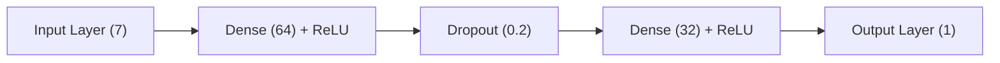

# NN Agent: Structural Complexity Model


This directory contains the training logic and artifacts for the **Neural Network (NN) Agent**. This model performs regression analysis on structural code metrics to predict a complexity score.

Unlike the LLM, which reads "text," this model reads "structure," making it highly efficient and consistent.

---

## 📊 Feature Engineering

The raw AST (Abstract Syntax Tree) data is processed into a **7-dimensional input vector**.

We distinguish between **Local** metrics (logic strictly within the function's immediate scope) and **Total** metrics (aggregating logic from all nested sub-functions).

| Feature Index | Feature Name            | Description                                            |
| :------------ | :---------------------- | :----------------------------------------------------- |
| 0             | `param_count`           | Number of arguments defined in the function signature. |
| 1             | `local_statement_count` | Number of statements in the immediate function body.   |
| 2             | `total_statement_count` | Statements in current function + all nested functions. |
| 3             | `local_variable_count`  | Variables declared in the immediate scope.             |
| 4             | `total_variable_count`  | Variables declared in current + nested scopes.         |
| 5             | `local_nesting_depth`   | Max nesting level of the immediate body.               |
| 6             | `total_nesting_depth`   | Deepest nesting level found in the entire tree.        |

**Preprocessing:**

- Features are normalized using `StandardScaler` (Scikit-Learn) to ensure zero mean and unit variance before entering the network.
- The scaler artifact (`scaler.pkl`) is saved to ensure inference data is transformed identically to training data.

---

## 🧠 Model Architecture

The model is a Feed-Forward Neural Network (Multi-Layer Perceptron) designed for regression.



- **Input Layer:** 7 Nodes (Corresponding to the features above).
- **Hidden Layer 1:** 64 Neurons, ReLU Activation.
- **Regularization:** Dropout (p=0.2) applied after layer 1 to prevent overfitting on the small dataset.
- **Hidden Layer 2:** 32 Neurons, ReLU Activation.
- **Output Layer:** 1 Neuron (Linear activation) representing the predicted complexity score.

---

## ⚙️ Training Configuration

The model was trained on the processed Semeru dataset (`aslam-naseer/js-function-complexity-processed`).

- **Loss Function:** `MSELoss` (Mean Squared Error).
- **Optimizer:** `Adam` (Learning Rate: 0.001).
- **Batch Size:** 64 (Training), 32 (Validation).
- **Epochs:** 50.

### Training Metrics

The model shows consistent convergence, with the validation loss stabilizing around **1.18 MSE**.

| Epoch | Train Loss | Val Loss   | Status             |
| :---- | :--------- | :--------- | :----------------- |
| 10    | 1.7190     | 1.3172     | ▼ Improving        |
| 20    | 2.4708     | 1.2932     | ⚠️ Transient Spike |
| 30    | 1.5058     | 1.2111     | ▼ Improving        |
| 40    | 1.4355     | 1.2254     | ➖ Stable          |
| 50    | 1.3653     | **1.1810** | ✅ Converged       |

---

## 📂 Files Included

- **`train.py`**: The main script containing the `NeuralNetwork` class, training loop, and scaler generation logic.
- **`artifacts/model.pth`**: The saved PyTorch state dictionary (weights).
- **`artifacts/scaler.pkl`**: The serialized StandardScaler object.
- **`normalize_features.py`**: Utility script to load the scaler and transform new input vectors during inference.

---

## ☁️ Cloud Deployment & Orchestration

To support the live **Hugging Face Spaces** demo, this NN Agent is deployed as a serverless function on **Modal.com**.

- **Microservice Architecture:** The Gradio app (Client) sends extracted structural features to a remote Modal container (Worker).
- **Inference Engine:** The worker loads the `model.pth` and `scaler.pkl` artifacts into memory on-demand.
- **Efficiency:** This decoupled approach allows the main UI to remain lightweight while offloading the PyTorch computation to specialized infrastructure.

---

## 🚀 Usage

### Local Inference

To use the trained model for local testing or offline analysis:

```python
import torch
import joblib
from complexity_nn import NeuralNetwork

# 1. Load Artifacts
model = NeuralNetwork(input_size=7)
model.load_state_dict(torch.load("artifacts/model.pth"))
model.eval()

scaler = joblib.load("artifacts/scaler.pkl")

# 2. Prepare Data (Example Feature Vector)
# [params, l_stmt, t_stmt, l_var, t_var, l_nest, t_nest]
raw_features = [[2, 5, 10, 3, 6, 2, 3]]

# 3. Scale & Predict
scaled_features = scaler.transform(raw_features)
tensor_input = torch.tensor(scaled_features, dtype=torch.float32)

with torch.no_grad():
    prediction = model(tensor_input)
    print(f"Predicted Complexity: {prediction.item()}")
```

### Remote Inference (Production)

The production environment uses the `agents/nn_agent.py` wrapper to call the Modal-hosted version of this model via a secure web endpoint.
